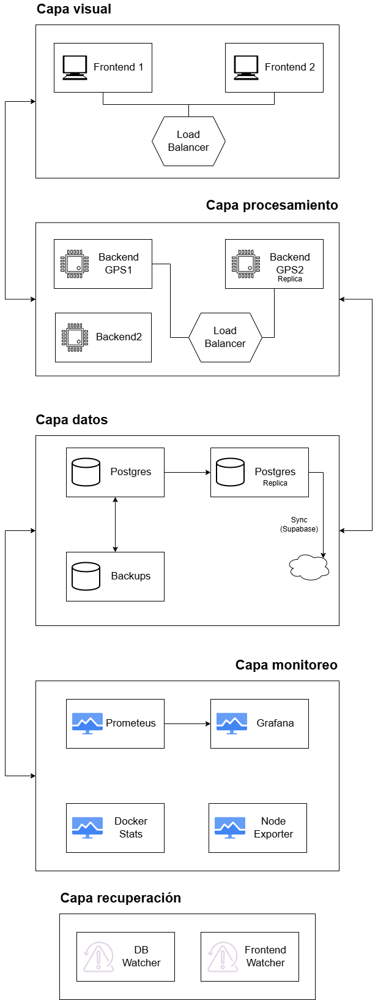

# Sistema de Monitoreo y Gestión de Flota GPS

## Descripción General

### Licitación elegida: Servicio monitoreo GPS y gestión de flota

**El sistema desarrollado responde a la necesidad institucional de monitorear en tiempo real la ubicación y estado de los vehículos, optimizando el uso de recursos y garantizando la seguridad operacional.
Las principales funcionalidades incluyen:**
- Monitoreo en tiempo real.
- Historial de recorrido.
- Alertas automáticas.
- Reportes automáticos.
- Gestión de usuarios y roles.
- Análisis y soporte.
- Tecnologías y requerimientos. 

****Integrantes del equipo:****
- Sebastián Carlos
- Alexis Ferghman
- Luis González

---

## Arquitectura del Sistema

### Diagrama de Arquitectura

### Servicios

| Servicio | Función |
|----------|---------|
| **frontend1** | Interfaz principal de usuario. Monitoreo GPS en tiempo real, gestión de usuarios, reportes y mapas interactivos. |
| **frontend2** | Instancia réplica del frontend para alta disponibilidad. |
| **nginx_lb** | Balanceador de carga Nginx. Distribuye tráfico HTTP entre frontend1 y frontend2.|
| **backend1 (backendgpsapp1)** | API REST para recepción y consulta de coordenadas GPS.|
| **backend1_replica (backendgpsapp2)** | Réplica del backend GPS para alta disponibilidad y balanceo de carga |
| **backend2** | API REST principal. Gestión de usuarios, vehículos, reportes y autenticación. |
| **db (PostgreSQL Principal)** | Base de datos principal. Almacena usuarios, vehículos, ubicaciones GPS y reportes. |
| **db_replica** | Base de datos réplica con replicación lógica. Permite lectura distribuida y backup en tiempo real. |
| **db_sync** | Sincronizador automático que replica datos desde `db_replica` hacia Supabase (nube) cada 60 segundos. Sincroniza tablas: users, vehiculo, reportes, reporte_eventualidad |
| **db_backup** | Servicio de backup automatizado con cron. Ejecuta backup completo diariamente a las 2:00 AM. |
| **adminer** | Interfaz web para administración de base de datos PostgreSQL. Permite ejecutar queries, ver tablas, exportar datos. |
| **prometheus** | Sistema de monitoreo y alertas. Recolecta métricas de todos los servicios cada 5 segundos. |
| **grafana** | Plataforma de visualización. Dashboards para métricas de CPU, RAM, red, estado de contenedores. |
| **node_exporter** | Exportador de métricas del sistema host (CPU, memoria, disco, red). |
| **docker_stats_exporter** | Exportador de estadísticas de contenedores Docker (uso de recursos por contenedor). |
| **db_watcher** | Monitor automático que verifica cada 30s el estado de `db_replica`. Si está caído, lo reinicia. |
| **frontend_watcher** | Monitor automático que verifica cada 30s el estado de `frontend1`. Si esta caído lo reinicia. |

### Tecnologías Utilizadas

- React 19.2.0: Framework moderno para interfaces reactivas. Componentes reutilizables y virtual DOM para renderizado eficiente.
- React Router 7.9.5: Navegación SPA (Single Page Application) sin recargas de página.
- Leaflet 1.9.4: Librería de mapas interactivos open-source. Ligera y flexible para visualización GPS.
- Axios 1.13.1: Cliente HTTP para consumir APIs REST. Manejo automático de promesas y errores.
- Nginx Alpine: Servidor web ligero y balanceador de carga de alto rendimiento. Bajo consumo de recursos.
- Node.js 20 + Express Alpine: Backend ligero para GPS. Ideal para operaciones I/O intensivas y manejo de múltiples conexiones simultáneas.
- Spring Boot 3.5.7: Framework empresarial robusto para Java. Autoconfiguración, seguridad integrada, ORM con JPA.
- Spring Security 3.5.7: Autenticación y autorización basada en roles (FLOTA, DAF, CHOFER). Protección CSRF y JWT.
- JPA/Hibernate: ORM para mapeo objeto-relacional. Simplifica operaciones CRUD y relaciones entre entidades.
- PostgreSQL 15.8: Base de datos relacional robusta. Soporte para replicación lógica, tipos de datos geoespaciales.
- Supabase Cloud: Backend para sincronización en nube. Backup remoto automático y acceso distribuido.
- Prometheus 2.55.0: Sistema de monitoreo time-series. Consultas PromQL poderosas y alertas configurables.
- Grafana 11.2.2: Visualización de métricas con dashboards personalizables. Integración nativa con Prometheus.
- Node Exporter 1.8.2: Exporta métricas del sistema operativo (CPU, RAM, disco, red).
- Docker Stat Exporter: Exporta estadísticas de contenedores Docker para monitoreo.

Para correr de manera remota la aplicación del gps, primero se debe entrar a los directorios backendgps para instalar las dependencias
npm install
luego levantar y construir el docker compose
docker compose up --build
para correr en cloudflare luego de todo lo anterior y tener instalado los servicios de cloudflare desde 
https://developers.cloudflare.com/cloudflare-one/networks/connectors/cloudflare-tunnel/downloads/
Por ultimo crear el tunnel en el localhost con el puerto 8081
cloudflared tunnel --url http://localhost:8081