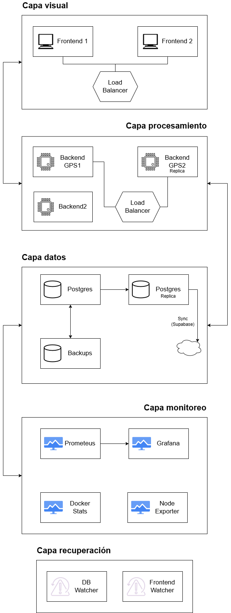
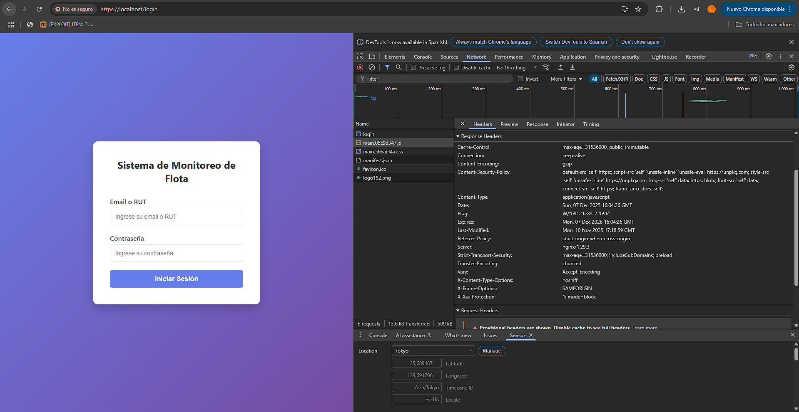
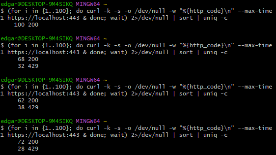
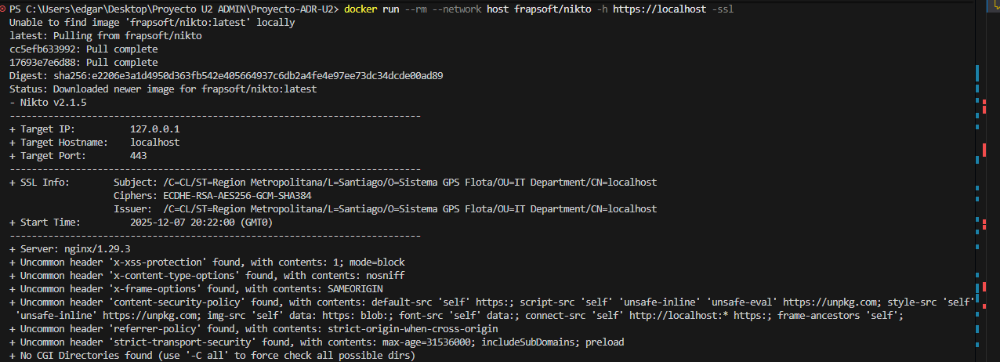
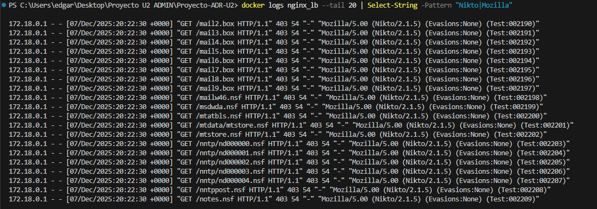

# Sistema de Monitoreo y Gestión de Flota GPS

## 1. Descripción General

### Licitación elegida: Servicio monitoreo GPS y gestión de flota

**El sistema desarrollado responde a la necesidad institucional de monitorear en tiempo real la ubicación y estado de los vehículos, optimizando el uso de recursos y garantizando la seguridad operacional.
Las principales funcionalidades incluyen:**
- Monitoreo en tiempo real.
- Historial de recorrido.
- Alertas automáticas.
- Reportes automáticos.
- Gestión de usuarios y roles.
- Análisis y soporte.
- Tecnologías y requerimientos. 

****Integrantes del equipo:****
- Sebastián Carlos
- Alexis Ferghman
- Luis González

---

## 2. Arquitectura del Sistema

### Diagrama de Arquitectura



### Servicios

| Servicio | Función |
|----------|---------|
| **frontend1** | Interfaz principal de usuario. Monitoreo GPS en tiempo real, gestión de usuarios, reportes y mapas interactivos. |
| **frontend2** | Instancia réplica del frontend para alta disponibilidad. |
| **nginx_lb** | Balanceador de carga Nginx. Distribuye tráfico HTTP entre frontend1 y frontend2.|
| **backend1 (backendgpsapp1)** | API REST para recepción y consulta de coordenadas GPS.|
| **backend1_replica (backendgpsapp2)** | Réplica del backend GPS para alta disponibilidad y balanceo de carga |
| **backend2** | API REST principal. Gestión de usuarios, vehículos, reportes y autenticación. |
| **db (PostgreSQL Principal)** | Base de datos principal. Almacena usuarios, vehículos, ubicaciones GPS y reportes. |
| **db_replica** | Base de datos réplica con replicación lógica. Permite lectura distribuida y backup en tiempo real. |
| **db_sync** | Sincronizador automático que replica datos desde `db_replica` hacia Supabase (nube) cada 60 segundos. Sincroniza tablas: users, vehiculo, reportes, reporte_eventualidad |
| **db_backup** | Servicio de backup automatizado con cron. Ejecuta backup completo diariamente a las 2:00 AM. |
| **adminer** | Interfaz web para administración de base de datos PostgreSQL. Permite ejecutar queries, ver tablas, exportar datos. |
| **prometheus** | Sistema de monitoreo y alertas. Recolecta métricas de todos los servicios cada 5 segundos. |
| **grafana** | Plataforma de visualización. Dashboards para métricas de CPU, RAM, red, estado de contenedores. |
| **node_exporter** | Exportador de métricas del sistema host (CPU, memoria, disco, red). |
| **docker_stats_exporter** | Exportador de estadísticas de contenedores Docker (uso de recursos por contenedor). |
| **db_watcher** | Monitor automático que verifica cada 30s el estado de `db_replica`. Si está caído, lo reinicia. |
| **frontend_watcher** | Monitor automático que verifica cada 30s el estado de `frontend1`. Si esta caído lo reinicia. |

### Tecnologías Utilizadas

- React 19.2.0: Framework moderno para interfaces reactivas. Componentes reutilizables y virtual DOM para renderizado eficiente.
- React Router 7.9.5: Navegación SPA (Single Page Application) sin recargas de página.
- Leaflet 1.9.4: Librería de mapas interactivos open-source. Ligera y flexible para visualización GPS.
- Axios 1.13.1: Cliente HTTP para consumir APIs REST. Manejo automático de promesas y errores.
- Nginx Alpine: Servidor web ligero y balanceador de carga de alto rendimiento. Bajo consumo de recursos.
- Node.js 20 + Express Alpine: Backend ligero para GPS. Ideal para operaciones I/O intensivas y manejo de múltiples conexiones simultáneas.
- Spring Boot 3.5.7: Framework empresarial robusto para Java. Autoconfiguración, seguridad integrada, ORM con JPA.
- Spring Security 3.5.7: Autenticación y autorización basada en roles (FLOTA, DAF, CHOFER). Protección CSRF y JWT.
- JPA/Hibernate: ORM para mapeo objeto-relacional. Simplifica operaciones CRUD y relaciones entre entidades.
- PostgreSQL 15.8: Base de datos relacional robusta. Soporte para replicación lógica, tipos de datos geoespaciales.
- Supabase Cloud: Backend para sincronización en nube. Backup remoto automático y acceso distribuido.
- Prometheus 2.55.0: Sistema de monitoreo time-series. Consultas PromQL poderosas y alertas configurables.
- Grafana 11.2.2: Visualización de métricas con dashboards personalizables. Integración nativa con Prometheus.
- Node Exporter 1.8.2: Exporta métricas del sistema operativo (CPU, RAM, disco, red).
- Docker Stat Exporter: Exporta estadísticas de contenedores Docker para monitoreo.
- Express: Se utiliza para la creacion del backendgps que se encarga de la api relacionada a el gps recibiendo y mandando localización de los usuarios.


## 3. Alta Disponibilidad

El sistema está diseñado bajo un esquema de alta disponibilidad (HA) para garantizar la continuidad operativa incluso ante fallas parciales de componentes.
Se implementan mecanismos de replicación, balanceo de carga y monitoreo continuo, tanto en el nivel de aplicación como de base de datos.

🔹 Balanceo de carga en el Frontend

El servicio frontend1 se despliega bajo un servidor Nginx configurado como load balancer.
Este distribuye el tráfico entrante entre los dos backends principales:

backendgpsapp1 (instancia principal)

backendgpsapp2 (réplica en modo activo-activo)

De esta forma, las solicitudes se balancean automáticamente, permitiendo manejar mayor concurrencia y evitar la sobrecarga de un único contenedor.

Ventajas:

Tolerancia a fallos del backend principal.

Escalabilidad horizontal inmediata.

Reducción de la latencia percibida por el usuario.

🔹 Replicación de base de datos (failover automático)

El sistema implementa una base de datos principal (db) y una db para los datos lógicos de usuarios, vehiculos, etc (db_replica), la cual opera bajo un esquema master–replica.

db_sync: sincroniza automáticamente los cambios hacia la base remota en Supabase, garantizando redundancia geográfica y respaldo en la nube.

Además, se incluye el contenedor db_watcher, el cual monitorea el estado de db_replica y la reinicia automáticamente en caso de caída, asegurando que el sistema vuelva a su estado operativo en menos de 30 segundos.

Ventajas:

Tolerancia a fallos de hardware o software.

Persistencia de los datos críticos.

Redundancia local y remota.

🔹 Monitoreo en tiempo real

La alta disponibilidad se apoya en un sistema de observabilidad basado en Prometheus y Grafana:

node_exporter → métricas del sistema.

docker_stats_exporter → métricas por contenedor Docker.

prometheus → recopilación y almacenamiento de métricas.

grafana → visualización con dashboards personalizables.

## 4. Componente IA 
La integración de la IA en el proyecto para la licitación fue pensada como una parte crucial para la interacción entre los usuarios administrativos de la aplicación y los datos generados por los vehículos monitoreados. 

Su función consiste en recolectar datos como ubicación, velocidad, estado y otras características del vehículo y su recorrido, con el fin de generar reportes relacionados con los hábitos de conducción, excesos de velocidad, paradas habituales, entre otros indicadores útiles para la gestión de flota. 
## 5. Como Usarlo 
### Requisitos 
Para un correcto funcionamiento del sistema se requiere un dispositivo con acceso a Internet, capaz de enviar datos GPS en tiempo real. En su defecto, se pueden utilizar herramientas de túnelización para permitir la conexión remota (recomendado), ya que para obtener la ubicación de manera remota se necesitan certificados SSL para el protocolo HTTPS, los cuales no se consideraron durante el desarrollo. 

Por otro lado, dado que el proyecto utiliza una base de datos en la nube (en este caso Supabase), se necesita una cuenta que contenga la base de datos donde se almacenará una de las réplicas de los datos de los usuarios. El dispositivo o servidor donde se ejecute el proyecto debe contar con: 

- Conexión estable a Internet (banda ancha simétrica recomendada). 
- Al menos 8 GB de RAM. 
- 256 GB de almacenamiento SSD para una mejor transferencia de datos. 
- Sistema operativo Ubuntu Server 22.04 (o similar).
- Docker y Docker Compose instalados y configurados correctamente. 

 ## Instalación y ejecución

``` bash
git clone https://github.com/Sebast200/Proyecto-ADR-U2.git
cd Proyecto-ADR-U2
```
Con esto se descargará y abrirá el repositorio del proyecto. Dentro del mismo se encuentran los directorios de los distintos contenedores, los cuales son orquestados y construidos mediante Docker Compose. 
Antes de ejecutar el proyecto, asegúrate de tener Docker instalado con una versión reciente:

```bash
docker -v
```
Ahora si procederemos con el buildeo y ejecucion de los contenedores docker
```bash
docker compose up --build #agregar opcion -d si no quiere bloquer la terminal
```
Este comando instalará todas las dependencias, sincronizará las bases de datos y levantará todos los servicios. 

Una vez finalizado el proceso, si no se muestran errores, el sistema estará operativo. 
## URLs de acceso y comandos útiles 
Dado que el sistema está compuesto por varios microservicios, se definieron distintos endpoints para cumplir con las diversas funciones del sistema.
### Monitoreo (Grafana)
La interfaz de monitoreo se encuentra disponible a través de Nginx con HTTPS:
```bash
https://localhost/grafana/
```

### Bases de datos (Adminer)
Para acceder a la interfaz de administración de las bases de datos locales directamente (sin pasar por nginx):

```bash
http://localhost:8080
```
### Página principal (Frontend)
El puerto principal del sistema es el **443 (HTTPS)**, donde Nginx actúa como load balancer, proporciona cifrado SSL/TLS y aplica protecciones de seguridad (WAF, rate limiting, security headers). Este es el puerto que debe exponerse para las conexiones remotas.

```bash
https://localhost
```

**Puerto HTTP (80):** Redirige automáticamente a HTTPS (puerto 443)

**⚠️ Advertencia de certificado:** El navegador mostrará una advertencia porque el certificado es autofirmado. Esto es normal en desarrollo. Haz clic en "Avanzado" → "Continuar a localhost" para acceder.
### Otros puertos importantes

#### Backend para usuarios (API REST)
```bash
https://localhost/api/
```
*Acceso directo sin nginx (solo desarrollo):* `http://localhost:3001`

#### Backend para GPS
*Acceso directo sin nginx (solo desarrollo):* `http://localhost:3000`

**⚠️ Importante:** Para aplicaciones en producción, **siempre usar las URLs con HTTPS** que pasan por Nginx. Los puertos directos (3000, 3001) no tienen rate limiting ni protección WAF.
### Uso de aplicacion remotamente
Nuestro uso de la aplicacion de manera remota fue gracias a cloudflare tunnel, donde se tuvo que instalar los paquetes desde:

https://developers.cloudflare.com/cloudflare-one/networks/connectors/cloudflare-tunnel/downloads/

Una vez instalado se puede tunelizar un puerto en específico para tener acceso remoto sin necesidad de tener una ip pública, ademas debemos especificar no-tls-verify, ya que nuestro certificado SSL es autofirmado (no confiable):
```bash
cloudflared tunnel --url https://localhost:443 --no-tls-verify
```
## Usuarios y contraseñas de prueba
Al ingresar al frontend, el sistema solicitará credenciales de usuario. Para registrar un usuario nuevo, se puede realizar una petición directa al backend con el siguiente formato (los roles disponibles son "FLOTA", "DAF" y "CHOFER"):
```bash
curl -X POST https://localhost/api/auth/register \
  -k \
  -H "Content-Type: application/json" \
  -d '{
    "rut": "11111111-1",
    "email": "encargado@flota.cl",
    "password": "123456",
    "firstName": "Mario",
    "lastName": "Fuentes",
    "role": "FLOTA"
  }'
```

## 6. Backup y Monitoreo

El sistema incluye un mecanismo automático de respaldos diarios de la base de datos local (db_replica) y herramientas para su restauración y supervisión.

🔹 Respaldos automáticos (cron job)

El servicio db_backup se ejecuta con una imagen de PostgreSQL y un cron job diario a las 02:00 AM, configurado para:

Generar un backup completo de la base db_replica en formato .sql.

Almacenar el archivo en la carpeta /scripts/backup/db_backups/.

Retener los últimos 7 días de respaldos.

Ruta en host:

./scripts/backup/db_backups/


Script principal:
scripts/backup/backup-db.sh

Ejecución manual (si se desea forzar un backup):

docker exec -it db_backup sh /backup/backup-db.sh

🔹 Restauración de datos

En caso de contingencia, se puede restaurar un respaldo con el script:

docker exec -it db_backup sh /backup/restore-db.sh /backup/db_backups/<archivo>.sql


Esto recarga el estado de la base desde el archivo seleccionado, permitiendo recuperación completa ante pérdida o corrupción de datos.

🔹 Monitoreo del sistema

Prometheus recoge métricas de todos los servicios.

Grafana presenta paneles con CPU, memoria, uso de red y estado de contenedores.

Las métricas se actualizan cada 5 segundos, con dashboards que permiten filtrar por contenedor específico.

Acceso local al monitoreo:

**Grafana** →  https://localhost/grafana/

**Prometheus →** http://localhost:9090


## 7. Seguridad y HTTPS

El sistema implementa una capa completa de seguridad mediante HTTPS con certificados TLS, garantizando que todas las comunicaciones entre clientes y servidores estén cifradas y protegidas.
**URL principal**: https://localhost:443

### Implementación HTTPS

#### Certificados TLS
- **Ubicación**: `nginx/certs/`
- **Tipo**: Certificados autofirmados con OpenSSL
- **Algoritmo**: RSA 4096 bits
- **Hash**: SHA-256
- **Validez**: 365 días (renovable)
- **Protocolos soportados**: TLSv1.2 y TLSv1.3

#### Redirección Automática HTTP → HTTPS
Todo el tráfico HTTP (puerto 80) se redirige automáticamente a HTTPS (puerto 443), garantizando que ninguna comunicación se realice sin cifrado.

```nginx
# Configuración en nginx/lb.conf
server {
    listen 80;
    server_name localhost;
    return 301 https://$host$request_uri;
}
```

### Headers de Seguridad HTTP

El servidor Nginx está configurado con headers de seguridad siguiendo las mejores prácticas de OWASP:

| Header | Valor | Propósito |
|--------|-------|-----------|
| **Strict-Transport-Security** | `max-age=31536000; includeSubDomains; preload` | Fuerza HTTPS durante 1 año. Previene downgrade attacks |
| **X-Frame-Options** | `SAMEORIGIN` | Protege contra clickjacking |
| **X-Content-Type-Options** | `nosniff` | Previene MIME-sniffing attacks |
| **X-XSS-Protection** | `1; mode=block` | Activa filtro anti-XSS del navegador |
| **Referrer-Policy** | `strict-origin-when-cross-origin` | Controla información de referencia enviada |
| **Content-Security-Policy** | Configuración personalizada | Protege contra XSS e inyección de código |


*Captura mostrando los headers de seguridad*

### 🔧 Generación de Certificados

El proyecto incluye un script automatizado para generar certificados SSL autofirmados:

**Ubicación**: `scripts/security/generate-certs.sh`

#### Uso básico (ejecutar con bash):
```bash
cd scripts/security
./generate-certs.sh
```

El script realiza automáticamente:
- Backup de certificados existentes
- Generación de clave privada RSA 4096 bits
- Creación de certificado autofirmado con SHA-256
- Configuración de permisos seguros (600 para key.pem, 644 para cert.pem)
- Validación y muestra de detalles del certificado

---

## 8. WAF y Rate Limiting

Protección contra ataques web mediante **Rate Limiting** y bloqueo de user-agents maliciosos directamente en Nginx.

### Configuración de Rate Limiting

Se definen **3 zonas de protección** con diferentes límites según el tipo de tráfico:

| Zona | Límite | Aplicación | Propósito |
|------|--------|------------|--------|
| **general** | 10 req/s | Frontend, Grafana (páginas generales) | Protección general contra saturación de la red |
| **api** | 5 req/s | Endpoints `/api/*` (excepto login) | Protección de API REST |
| **login** | 3 req/m | `/api/auth/login`, `/api/auth/register`, `/grafana/login`, `/grafana/api/login`, `/grafana/api/auth` | Prevención de ataques de fuerza bruta en autenticación |

#### Parámetros de configuración:
- **burst**: Permite ráfagas temporales (20 para general, 10 para API, 2 para login)
- **nodelay**: No agrega latencia adicional cuando hay ráfagas
- **limit_req_status 429**: Devuelve código HTTP 429 (Too Many Requests) cuando se excede el límite

#### ⚙️ Cómo funciona el rate limiting:
- **Zona general y API**: El límite se reinicia cada segundo (10 req/s o 5 req/s)
- **Zona login**: El límite se reinicia cada minuto (3 req/m)
  - Primera petición del minuto: Permitida
  - Segunda petición: Permitida
  - Tercera petición: Permitida
  - Cuarta petición en adelante: Bloqueada (429) hasta que pase 1 minuto
  - Con `burst=2`, permite hasta 5 peticiones rápidas (3 normales + 2 de burst), luego bloquea todo hasta el próximo minuto

### Bloqueo contra usuarios maliciosos (WAF)

Se implementa un **Web Application Firewall (WAF)** básico mediante detección de user-agents maliciosos. El sistema bloquea automáticamente herramientas y scripts conocidos por actividades maliciosas:

#### User-Agents Bloqueados:

**Categoría: Bots y Crawlers**
- `bot` - Bots genéricos no identificados
- `crawler` - Crawlers no autorizados
- `spider` - Web spiders de scraping
- `scrap` - Detecta: scraper, scrapy, scraping
- `scanner` / `scan` - Scanners genéricos
- `nikto` - Nikto Web Scanner
- `nuclei` - Nuclei vulnerability scanner
- `acunetix` - Acunetix Web Scanner (comercial)
- `nessus` - Nessus vulnerability scanner
- `openvas` - OpenVAS security scanner
- `sqlmap` - Herramienta de SQL injection
- `nmap` - Port scanner de redes
- `masscan` - Port scanner masivo
- `metasploit` - Framework de explotación
- `burp` - Burp Suite proxy/scanner

#### User-Agents Permitidos:
- `curl` - Permitido para testing y desarrollo
- `wget` - Permitido para healthchecks

#### Respuesta ante detección:
- **Código HTTP**: `403 Forbidden`
- **Mensaje JSON**: `{"error": "Forbidden - Malicious user-agent detected"}`
- **Log**: Se registra en `/var/log/nginx/access.log`

### Logs

Todos los bloqueos y peticiones sospechosas se registran en:
- **Access Log**: `/var/log/nginx/access.log`
- **Error Log**: `/var/log/nginx/error.log`

Para ver peticiones bloqueadas en tiempo real:
```bash
# Ver rate limiting en acción
docker logs nginx_lb -f | grep "limiting"

# Ver user-agents bloqueados
docker logs nginx_lb | grep "403"
```

### Comandos de Prueba Manual

Para probar manualmente el rate limiting por zona (ejecutar desde Git Bash):

#### Test de las 3 zonas juntas:
```bash
echo "=== Comparación de Zonas de Rate Limiting ===" && echo "" && \
echo "1. Zona GENERAL (10 req/s):" && \
(for i in {1..50}; do curl -k -s -o /dev/null -w "%{http_code}\n" --max-time 1 https://localhost:443/ & done; wait) 2>/dev/null | sort | uniq -c && echo "" && \
echo "2. Zona API (5 req/s):" && \
(for i in {1..50}; do curl -k -s -o /dev/null -w "%{http_code}\n" --max-time 1 https://localhost:443/api/health & done; wait) 2>/dev/null | sort | uniq -c && echo "" && \
echo "3. Zona LOGIN - Frontend (3 req/min):" && \
for i in {1..10}; do curl -k -s -o /dev/null -w "%{http_code}\n" https://localhost:443/api/auth/login 2>/dev/null; done | sort | uniq -c && echo "" && \
echo "4. Zona LOGIN - Grafana (3 req/min):" && \
for i in {1..10}; do curl -k -s -o /dev/null -w "%{http_code}\n" https://localhost:443/grafana/login 2>/dev/null; done | sort | uniq -c
```

**Resultados esperados:**

La primera vez que ejecutes verás 3 peticiones exitosas y el resto bloqueadas. Si vuelves a ejecutar inmediatamente, **todas serán bloqueadas (429)** porque el límite es por minuto:

```
=== Comparación de Zonas de Rate Limiting ===

1. Zona GENERAL (10 req/s):
     38 200
     12 429

2. Zona API (5 req/s):
     21 404
     29 429

3. Zona LOGIN - Frontend (3 req/min):
      3 405  (o 200/404 dependiendo del endpoint)
      7 429

4. Zona LOGIN - Grafana (3 req/min):
      3 200
      7 429
```

### Evidencia de Funcionamiento


*Revision de peticiones aceptadas 200 vs bloqueadas 429*


*Prueba utilizando nikto para la web*


*Logs bloqueando a nikto*

### Configuración Técnica

```nginx
# Definición de zonas
limit_req_zone $binary_remote_addr zone=general:10m rate=10r/s;
limit_req_zone $binary_remote_addr zone=api:10m rate=5r/s;
limit_req_zone $binary_remote_addr zone=login:10m rate=3r/m;

# Aplicación por location
location / {
    limit_req zone=general burst=20 nodelay;
    limit_req_status 429;
    proxy_pass http://frontend_cluster;
}
```


